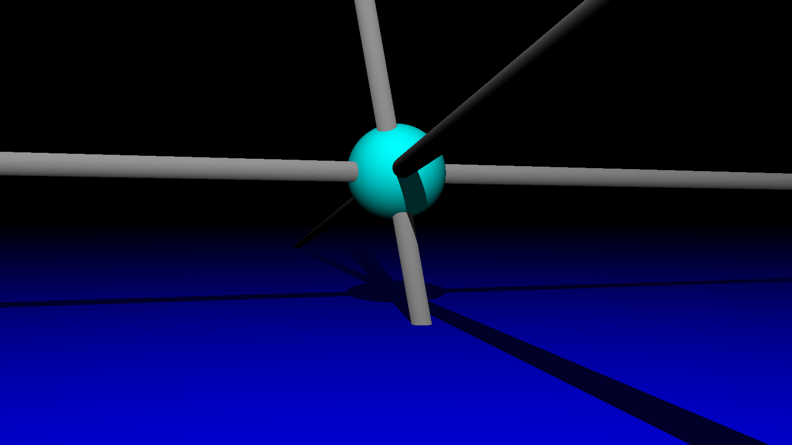
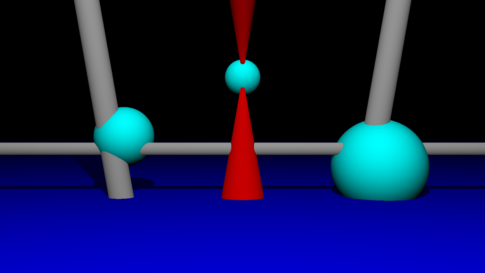
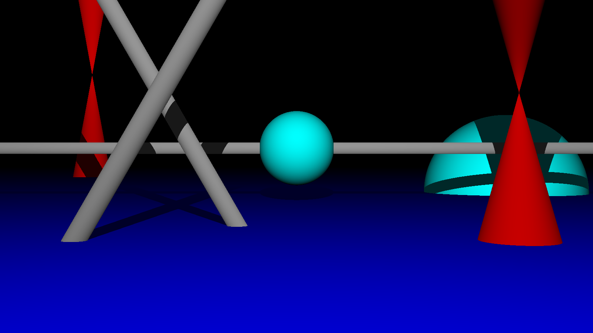
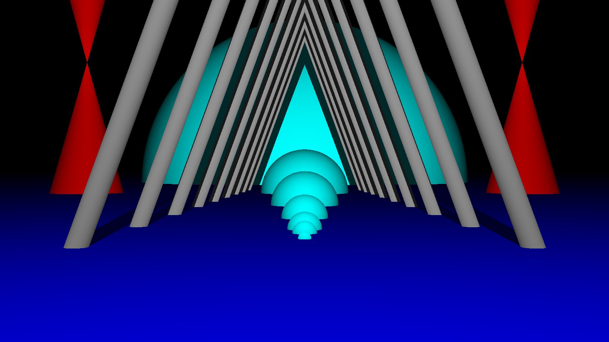

# raytracer1
This project was one of my graphical projects from my first year at EPITECH (2016-2017)

The goal of a raytracer is to **draw 3D objects** by using [raytracing](https://en.wikipedia.org/wiki/Ray_tracing_(graphics)).

_This is a very basic raytracer, but I made later (in a group of 4 people) a more advanced version, available_ [_here_](https://github.com/arthurphilippe/raytracer2).

<br>

Language: **C**

Group size: **1**

Project duration: **~45 days** (06/02/2017 - 19/03/2017)

Compilation: **on GNU/Linux via Makefile**

#### Required library: **CSFML** graphic library
To install it: 
* on Debian / Ubuntu: `sudo apt-get install libcsfml-dev`
* on Arch Linux: `sudo pacman -S csfml`
* on other distributions, download it [here](https://www.sfml-dev.org/download/csfml/)

<br>

## Usage: 
`./raytracer1 'scene.txt'`

### scene file:
The scene configuration file is composed of one or more objects.

Object values: 
* obj: **1** (sphere), **2** (cylinder) or **3** (cone)
* trans: **tanslation** (X, Y and Z)
* rot: **rotation** (X, Y and Z)
* var: **object size**

All the elements (values and value names) must be separated by a newline.

All the objects must be separated by `******`

### Scene file example:
```
obj:
1
trans:
0
-220
-150
var:
60
******
obj:
2
trans:
0
200
0
rot:
20
0
0
var:
25
```

<br>

## Authorized functions for this project:

* C Math library (-lm)
* C Libdl (-ldl)
* Pthread library (-lpthread)
* open
* close
* read
* write
* malloc
* free

### CSFML functions:

* sfRenderWindow_isOpen
* sfRenderWindow_pollEvent
* sfRenderWindow_waitEvent
* sfRenderWindow_clear
* sfRenderWindow_drawSprite
* sfRenderWindow_display
* sfRenderWindow_create
* sfRenderWindow_destroy
* sfRenderWindow_close
* sfTexture_create
* sfTexture_updateFromPixels
* sfTexture_destroy
* sfSprite_create
* sfSprite_setTexture
* sfSprite_destroy
* all of System module’s functions
* all of Window module’s functions
* all of Audio module’s functions
 
<br>

## Screenshots






